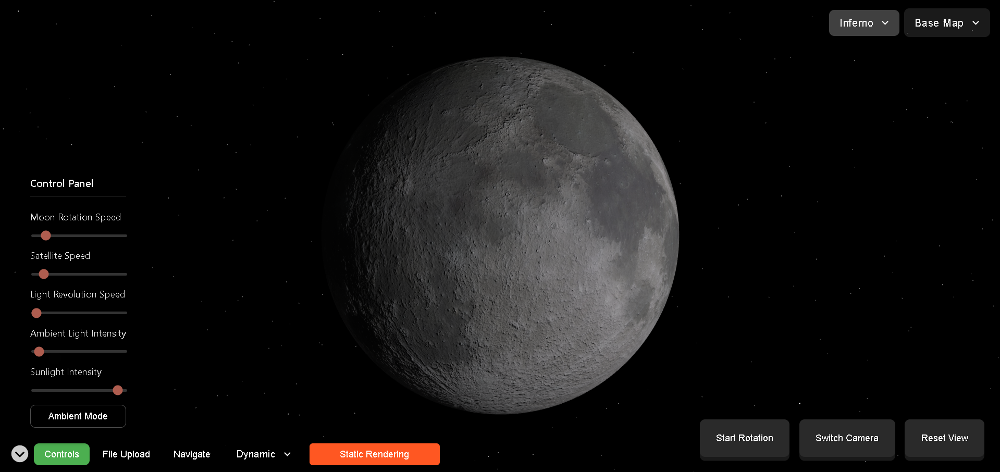
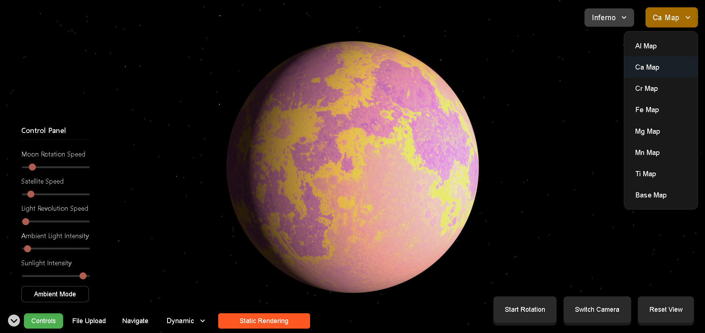
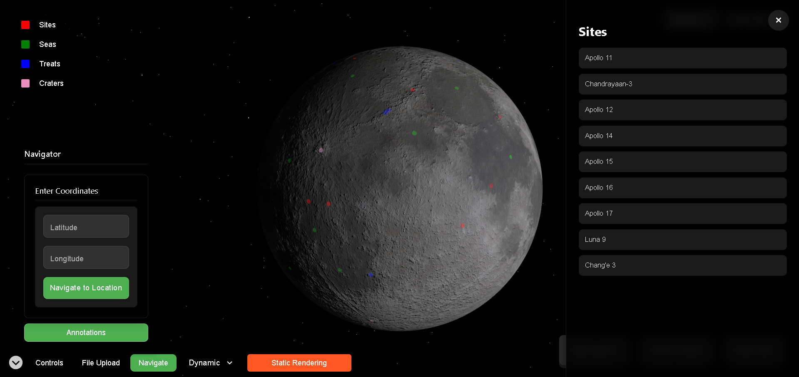
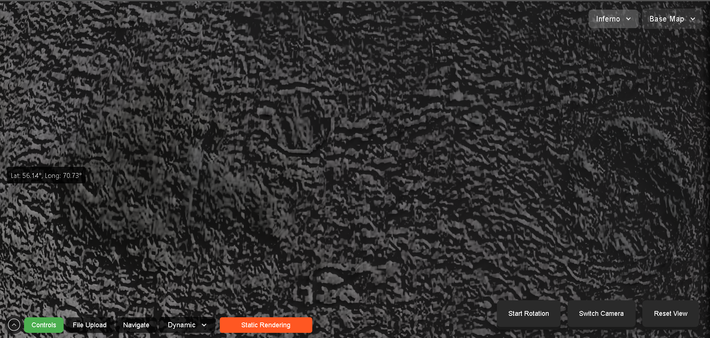

# Lunar Surface Elemental Mapping

## Landing Page

Features a detailed 3D model of the Moon, along with a control panel for parameter adjustments. The dashboard is fully interactive, allowing users to zoom and pan to view the Moon from any angle. The Moon's rotation speed can also be adjusted as needed.

## Calcium Mapping (Example)

Inferno and Uncertainty maps of different elements can be visualized on the Lunar Surface by selecting the element and map type from the dropdown menus. This example showcases the inferno map of Calcium.

## Annotations

Annotations can be activated through the Navigate button, revealing different Landing Sites, Craters, Seas, and Visual Features. These appear as clickable dots that display coordinates and descriptions when selected.

## Apollo 12 Landing Site (Example)

This displays the Apollo 12 Landing Site, complete with its precise coordinates and detailed description on the Lunar Surface.

## Satellite View

The camera can be switched to Satellite view to observe the Moon's surface from the perspective of a satellite camera.
